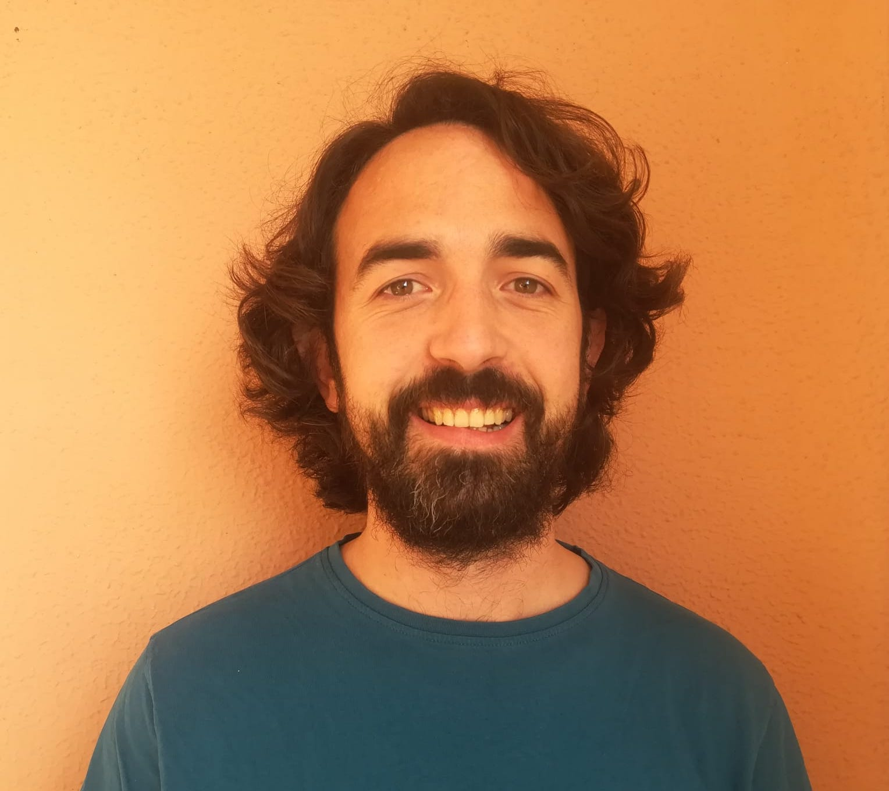

My name is Andreu Font-Ribera, and staff scientitst at the
<a href="http://www.ifae.es/eng/">Institut de Física d'Altes Energies (IFAE)</a>, in my hometown of Barcelona.

For years my website said that it was under construction, with the hope that one day it would be amazing, but now I accept that it will most likely stay like this for a while.

## Brief CV

Before moving to IFAE, I was:
  * a PhD student at the Institut de Ciencies de l'Espai (Barcelona, 2007-2011)
  * a postdoc at the University of Zurich (Zurich, 2011-2013)
  * a postdoc at the Lawrence Berkeley National Laboratory (Berkeley, 2013-2016)
  * a lecturer at University College London (London 2016-2020)

From 2016 to 2020 I was supported by a STFC Ernest Rutherford Fellowship (grant reference ST/N003853/1) and now I am supported by FSE funds trough the  program Ramon y Cajal (RYC-2018-025210) of the Spanish Ministry of Science and Innovation.

## Research Interests

Most of my research interests are in the area of observational cosmology.
I am particularly interested in the analysis of large spectroscopic datasets to study the large-scale structure of the Universe. 
In short, I construct 3D maps of the distribution of mass as a function of time, and I use these maps to understand better the evolution of the Universe.

During the last ten years I have been heavily involved in the cosmological analysis of the <a href="http://www.sdss3.org/surveys/boss.php/">Baryon Oscillation Spectroscopic Survey (BOSS)</a> collaboration, and of its successor 
<a href="https://www.sdss.org/surveys/eboss/">eBOSS</a>.
The final results will be published in mid 2020.

Our measurements of Baryon Acoustic Oscillations (BAO) at high redshift provide 
very accurate constraints on the expansion history of the Universe. 
You can find a press release from 2014 
<a href="http://newscenter.lbl.gov/news-releases/2014/04/07/boss-quasars-measure-expansion">here</a> 
and a more updated outreach article 
<a href="http://www.earlyuniverse.org/the-universe-before-dark-energy/">here</a>.

I am now chairing the Lyman alpha forest Working Group of the 
<a href="http://desi.lbl.gov">Dark Energy Spectroscopic Instrument (DESI)</a>.
Starting in 2021, DESI will try to solve the mistery of Dark Energy, while measuring the mass of the neutrinos, the lightest particles that exist.
        
## Publications 
You can find an exhaustive list of my publications on 
<a href="https://arxiv.org/search/advanced?advanced=&terms-0-operator=AND&terms-0-term=font-ribera&terms-0-field=author&classification-physics_archives=all&classification-include_cross_list=exclude&date-filter_by=all_dates&date-year=&date-from_date=&date-to_date=&date-date_type=submitted_date&abstracts=hide&size=200&order=-announced_date_first">arXiv</a>.

## Contact information

