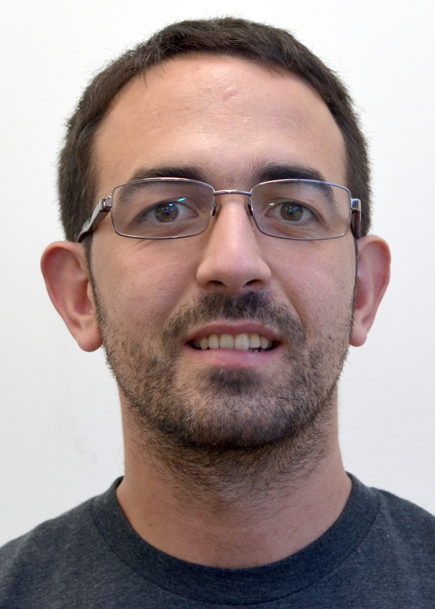

## Welcome to my personal web page (under construction...)

My name is Andreu Font-Ribera, and I'm cosmologist studying the large scale structure of the Universe. 
Before moving to University College London (as a Rutherford Fellow) I was at the Institut de Ciencies de l'Espai (Barcelona, 2007-2011), at the University of Zurich (Zurich, 2011-2013) and at the Lawrence Berkeley National Laboratory (Berkeley, 2013-2016).

## Research Interests

I study the Large Scale Structure of the universe using spectroscopic data, mainly from the 
<a href="http://www.sdss3.org/surveys/boss.php/">Baryon Oscillation Spectroscopic Survey (BOSS)</a> collaboration. 
In particular, I study the Lyman alpha forest and quasars as tracers of the density field.
Our measurements of Baryon Acoustic Oscillations (BAO) at high redshift provide 
very accurate constraints on the expansion history of the Universe. 
You can find a press release from 2014 
<a href="http://newscenter.lbl.gov/news-releases/2014/04/07/boss-quasars-measure-expansion">here</a> 
and a more updated outreach article here.
        
